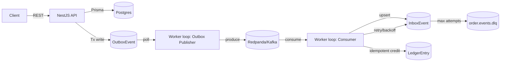

# shopback-cashback-ledger

A ShopBack-style cashback ledger demo showcasing contract-first APIs, idempotency, Outbox + Kafka, Inbox retry + DLQ, Kubernetes rollout/canary, and observability (Prometheus/Grafana, alerts, and SLO framing).

## Why This Project

Cashback/reward flows are distributed and failure-prone:

- client retries can duplicate requests
- DB commit and message publish can become inconsistent
- Kafka at-least-once delivery can duplicate events
- operations need clear retry, DLQ, replay, and fault-drill workflows

This repo keeps the scope small but demonstrates production-grade reliability patterns end-to-end.

## Architecture Snapshot



Note: in this demo, publisher and consumer are two logical loops in one worker process.

## Key Properties

- idempotent API via `Idempotency-Key` + request hash + cached response
- Outbox pattern to avoid DB/Kafka dual-write gaps
- at-least-once safe consumer with inbox dedupe and idempotent ledger constraint
- retry with backoff, DLQ, and replay CLI
- rolling update + canary (second deployment + shared Service)
- API/worker metrics, Grafana dashboard, alert rules, and SLO discussion points

## API Contract (Contract-First)

- Swagger: `/docs`
- `POST /orders` (supports `Idempotency-Key`)
- `POST /orders/{id}/confirm` (transactional confirm + outbox write)
- `GET /users/{id}/cashback-balance` (ledger aggregation)
- `POST /merchants/{id}/cashback-rule` (rule upsert)

Response envelope:

```json
{ "requestId": "...", "data": {}, "error": null }
```

## Data Model (Postgres)

- `Order`
- `CashbackRule`
- `LedgerEntry` with `unique(orderId,type)` for idempotent credit
- `IdempotencyKey` (key + scope + request hash + cached response)
- `OutboxEvent` (durable publish buffer)
- `InboxEvent` (durable processing queue with retry status)

## Reliability Patterns (Interview Talking Points)

### 1) Idempotency

- same key + same payload hash => replay same response
- same key + different hash => `409 Conflict`
- DB uniqueness is a second safety net

### 2) Outbox

- confirm transaction writes `Order(CONFIRMED)` + `OutboxEvent(OrderConfirmed)`
- worker publish loop retries until `SENT`

### 3) Inbox + Retry + DLQ + Replay

- consumer upserts `InboxEvent(sourceEventId)` to dedupe
- retry loop handles `PENDING` with exponential backoff
- max attempts => `FAILED` + DLQ produce
- replay CLI resets `FAILED -> PENDING` for controlled reprocessing

## Observability

- API metrics: `/metrics` (HTTP RED)
- Worker metrics: `:9100/metrics` (backlog/retry/DLQ/cache/handler latency)
- Grafana dashboard: `ShopBack Cashback Ledger (Demo)`
- alerts:
  - API 5xx rate > 1% for 5 minutes
  - `worker_inbox_failed > 0`

## Load Testing and Fault Drill

- k6 baseline summary:
  - baseline profile around p95 `~23ms` (`LT-001`)
  - tuned profile around p95 `~21ms` with user-based throttling and healthy error rate (`LT-003`)
- detailed run registry and caveats:
  - [docs/loadtest-baseline.md](docs/loadtest-baseline.md)
- fault drill summary:
  - worker down => backlog grows
  - worker recovery => backlog drains (eventual consistency)
  - reproducible steps in [docs/testing-playbook.md](docs/testing-playbook.md)

## Tech Stack

- API: NestJS
- Worker: Node.js + TypeScript
- Database: PostgreSQL + Prisma
- Cache: Redis
- Event streaming: Redpanda (Kafka API)
- Local infra: Docker Compose
- Kubernetes: kind + kustomize

## Repository Layout

```text
apps/
  api/        # NestJS HTTP API
  worker/     # outbox publisher + consumer + replay CLI
packages/
  db/         # Prisma schema, migrations, generated client (@sb/db)
infra/
  docker/     # Dockerfiles for API and worker
  docker-compose/
  k8s/
docs/
```

## Prerequisites

- Node.js 22+
- pnpm 10+
- Docker
- Optional for k8s: `kind`, `kubectl`
- Optional for monitoring stack: `helm`

## Quickstart (Local)

1. Install dependencies:

```bash
pnpm install
```

2. Start infra:

```bash
make up
```

3. Prepare env files:

```bash
cp apps/api/.env.example apps/api/.env
cp apps/worker/.env.example apps/worker/.env
```

4. Generate Prisma client and apply migrations:

```bash
pnpm db:generate
pnpm db:migrate
```

5. Create topics:

```bash
docker exec -i sb-redpanda rpk topic create order.events -p 1 -r 1 || true
docker exec -i sb-redpanda rpk topic create order.events.dlq -p 1 -r 1 || true
docker exec -i sb-redpanda rpk topic list
```

6. Run API and worker in separate terminals:

```bash
export VERSION=v1
pnpm dev:api
pnpm dev:worker
```

7. Open Swagger:

- [http://localhost:3000/docs](http://localhost:3000/docs)

## Local API Smoke Test

Create order:

```bash
curl -s -X POST http://localhost:3000/orders \
  -H 'Content-Type: application/json' \
  -H 'Idempotency-Key: create-001' \
  -d '{"userId":"u_1","merchantId":"m_1","amount":100,"currency":"SGD"}'
```

Confirm order:

```bash
curl -s -X POST http://localhost:3000/orders/<ORDER_ID>/confirm \
  -H 'Idempotency-Key: confirm-001'
```

Read balance:

```bash
curl -s http://localhost:3000/users/u_1/cashback-balance
```

## Local kind + Kubernetes Deployment

Recommended one-command bootstrap (k8s-first):

```bash
make k8s-up
```

Optional toggles:

```bash
SKIP_BUILD=true make k8s-up
ENABLE_MONITORING=false make k8s-up
RUN_SMOKE_TESTS=false make k8s-up
```

CLI-style flags:

```bash
make k8s-up ARGS="--skip-build --skip-monitoring --skip-smoke"
```

Extra helpers:

```bash
make k8s-smoke
make k8s-down
make k8s-down ARGS="--prune-docker"
```

Manual step-by-step (kept for learning/debugging):

1. Create cluster:

```bash
kind create cluster --name sb-ledger --config infra/k8s/kind-config.yaml
kubectl cluster-info
```

2. Build images from repository root:

```bash
make docker-build
```

3. Load images into kind:

```bash
kind load docker-image sb-ledger-api:dev --name sb-ledger
kind load docker-image sb-ledger-worker:dev --name sb-ledger
```

4. Deploy manifests:

```bash
kubectl apply -k infra/k8s/base
kubectl -n sb-ledger get pods
```

5. Topics are auto-created in-cluster (via Job), then verify:

```bash
kubectl -n sb-ledger wait --for=condition=complete job/redpanda-topics --timeout=180s || true
kubectl -n sb-ledger logs job/redpanda-topics || true
kubectl -n sb-ledger exec deploy/redpanda -- rpk topic list
```

Expected: both `order.events` and `order.events.dlq` are present.

6. Open Swagger:

- [http://localhost:30080/docs](http://localhost:30080/docs)

7. Verify health version:

```bash
curl -s http://localhost:30080/health
```

Expected: response envelope includes `data.version` (from `sb-ledger-config.VERSION`).

8. Verify Prometheus metrics endpoint:

```bash
curl -s http://localhost:30080/metrics | grep -E 'http_requests_total|http_request_duration_seconds' | head
```

Expected: plain-text Prometheus output with `http_requests_total` and `http_request_duration_seconds`.

9. Verify worker metrics (port-forward):

```bash
kubectl -n sb-ledger port-forward deploy/worker 19100:9100
```

Open another terminal:

```bash
curl -s http://localhost:19100/metrics | grep -E 'worker_(inbox_|outbox_|dlq_|cashback_rule_cache_|order_confirmed_handler_duration_seconds)' | head
```

Expected: plain-text Prometheus output with worker business metrics, for example:

- `worker_inbox_pending`
- `worker_inbox_failed`
- `worker_outbox_pending`
- `worker_dlq_produced_total`
- `worker_inbox_retries_total`
- `worker_cashback_rule_cache_hits_total`
- `worker_cashback_rule_cache_misses_total`
- `worker_order_confirmed_handler_duration_seconds`

10. Verify API rate limiting and 429 observability:

```bash
# same user -> should hit limit
for i in $(seq 1 1200); do
  curl -s -o /dev/null -w "%{http_code}\n" -H 'X-User-Id: demo-user-1' http://localhost:30080/health
done | sort | uniq -c
```

Expected: both `200` and `429` should appear under burst traffic.

```bash
# different users -> easier to stay below per-user limit
for i in $(seq 1 1200); do
  curl -s -o /dev/null -w "%{http_code}\n" -H "X-User-Id: user-$i" http://localhost:30080/health
done | sort | uniq -c
```

Expected: `429` should be near zero in mixed-user traffic.

To avoid Service load-balancing ambiguity, verify metrics on one pod directly:

```bash
API_POD=$(kubectl -n sb-ledger get pods --no-headers | awk '/^api-/{print $1; exit}')
kubectl -n sb-ledger port-forward pod/${API_POD} 18081:3000
```

In another terminal:

```bash
curl -s http://127.0.0.1:18081/metrics | grep 'http_requests_total' | grep 'status="429"'
```

Expected: `http_requests_total{...,status="429"}` is present.

## Canary Demo (Second Deployment + Same Service)

Canary setup in this repository:

- `api` is stable (`VERSION=v1` from ConfigMap)
- `api-canary` is canary (`VERSION=v2-canary`)
- Both pods share label `app: api`
- Service selector remains `app: api`, so traffic is mixed across stable and canary pods

1. Apply manifests and check deployments:

```bash
kubectl apply -k infra/k8s/base
kubectl -n sb-ledger get deploy
```

2. Optional: set stable/canary ratio for demonstration (4:1 ~= 20%):

```bash
kubectl -n sb-ledger scale deploy/api --replicas=4
kubectl -n sb-ledger scale deploy/api-canary --replicas=1
kubectl -n sb-ledger get deploy api api-canary
```

3. Verify mixed traffic by calling health 10 times:

```bash
for i in $(seq 1 10); do curl -s http://localhost:30080/health; echo; done
```

Expected: most responses show `v1`, and some show `v2-canary`.

4. Roll back canary quickly:

```bash
kubectl -n sb-ledger scale deploy/api-canary --replicas=0
```

5. Verify all traffic is back to stable:

```bash
for i in $(seq 1 10); do curl -s http://localhost:30080/health; echo; done
```

## Observability / Monitoring Stack (Prometheus + Grafana)

Manual deployment and monitoring installation:

- follow [docs/deployment-guide-k8s-first.md](docs/deployment-guide-k8s-first.md)
- includes kube-prometheus-stack install, ServiceMonitors, dashboard provisioning, and alert rules

Scenario verification and expected results:

- follow [docs/testing-playbook.md](docs/testing-playbook.md)
- includes Prometheus target checks, Grafana dashboard checks, alert validation, and worker down/recovery fault drill

### Metrics

- API exposes Prometheus metrics at `/metrics` (HTTP RED metrics)
- Worker exposes metrics at `:9100/metrics` (backlog / retries / DLQ)

### Dashboards & Alerts (k8s)

- Grafana dashboard: **ShopBack Cashback Ledger (Demo)**
- PrometheusRule:
  - API 5xx rate > 1% (5m)
  - Inbox failed > 0

## Load Testing (k6)

- Script: `infra/loadtest/k6-create-confirm.js`
- Scenario: create order + confirm order with staged VUs

Run baseline with Docker:

```bash
docker run --rm --network host -i grafana/k6 run --quiet -e BASE_URL=http://localhost:30080 - < infra/loadtest/k6-create-confirm.js
```

Baseline snapshot:

- [Load Test Baseline](docs/loadtest-baseline.md)
- Includes original baseline, per-IP protected profile, and the updated user-based throttling result.

## Prisma and Migration Runtime Contract

- Prisma schema and generated client live in `packages/db` and are consumed via `@sb/db`.
- Both Docker images run `pnpm -C packages/db run generate` during build, so Prisma client is included in the image at build time.
- API startup can run schema migrations via `prisma migrate deploy` when `RUN_DB_MIGRATION=true`.
- Kubernetes currently enables this in `infra/k8s/base/api.yaml`.
- Kubernetes ConfigMap includes `VERSION` for API/worker runtime version tagging and canary comparisons.
- There is no dedicated `db-migrate-job` and no Prisma initContainer in API/worker deployments.

## Useful Commands

Docker Compose:

```bash
make ps
make logs
make down
make reset
```

Kubernetes:

```bash
kubectl -n monitoring get pods
kubectl -n sb-ledger get pods
kubectl -n sb-ledger get pods -l app=worker
kind load docker-image sb-ledger-api:dev --name sb-ledger
kubectl -n sb-ledger rollout restart deploy/api
kubectl -n sb-ledger rollout status deploy/api
kubectl -n sb-ledger logs deploy/api --tail=200
kubectl -n sb-ledger logs deploy/worker --tail=200
```

## Quality Commands

```bash
make docs-check
pnpm lint
pnpm typecheck
pnpm test
```

## Further Documentation

- [Deployment Guide (Kubernetes-First with Local Option)](docs/deployment-guide-k8s-first.md)
- [Testing Playbook (All Scenarios)](docs/testing-playbook.md)
- [Kubernetes Operations Handbook (Useful Commands)](docs/k8s-operations-handbook.md)
- [System Design and Operations Story](docs/system-design-and-operations-story.md)
- [Architecture Decision Records (ADR Index)](docs/adr/README.md)
- [ADR-001: Idempotency Strategy](docs/adr/ADR-001-idempotency.md)
- [ADR-002: Outbox Pattern](docs/adr/ADR-002-outbox.md)
- [ADR-003: At-least-once + Inbox Retry + DLQ](docs/adr/ADR-003-at-least-once.md)
- [Architecture Flow Chart](docs/diagrams/architecture.mmd)
- [Confirm Sequence Diagram](docs/diagrams/sequence-confirm.mmd)
- [Failure Sequence Diagram](docs/diagrams/sequence-failure.mmd)
- [Documentation Index](docs/README.md)
- [Load Test Baseline (k6)](docs/loadtest-baseline.md)
